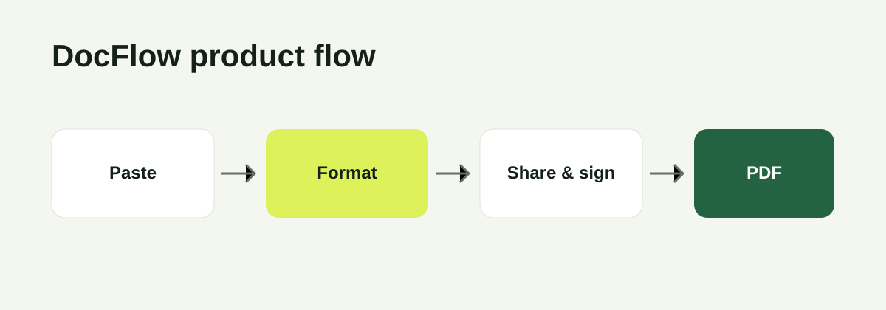

# DocFlow

> **Live demo:** Add your deployed URL here after following the deployment notes below.

DocFlow is a deliberately lightweight document workflow: paste rough business text, turn it into a polished document, send an unguessable review link, collect a single signature, and download a final locked PDF. It solves the awkward gap between a rough draft in a message and an easy-to-review document, without turning a small task into an account-creation exercise.



> Screenshots/GIF: record the create → share → sign → download flow and replace the image above with `public/screenshots/docflow-flow.gif` (or add 2–3 PNG screenshots in this folder).

## Stack

- **Next.js App Router + TypeScript** for a compact full-stack application with server routes next to the UI.
- **Prisma + SQLite** for a zero-service local setup; a clone can run its own durable local database immediately.
- **OpenAI API (optional)** for intelligent structuring. The app has an 8-second timeout and deterministic local formatter, so the core workflow continues if the API is absent, slow, or fails.
- **A small server-side PDF generator** produces a real downloadable PDF without a browser print dialog or external PDF service.

## Run locally

Requires Node.js 20+.

```bash
cp .env.example .env
npm install
npx prisma generate
npx prisma migrate dev
npm run dev
```

Open [http://localhost:3000](http://localhost:3000). `OPENAI_API_KEY` is optional: leave it blank to exercise the reliable built-in formatter, or add a key to enable AI structuring.

## Full flow to test

1. Paste rough text and select a document type.
2. Create the polished document; it starts as **Draft**.
3. Generate/copy its share link; its status becomes **Sent**.
4. Open the link in another browser window, review, and type or draw a signature.
5. The document becomes **Signed**, is locked from further signing, and the recipient can download the final PDF.

## Design decisions

- **Share links rather than accounts:** a long, unguessable token gives a one-click recipient experience and keeps v1 focused. This is appropriate for lightweight document sharing, not a substitute for enterprise identity/access controls.
- **One signer, one immutable final state:** this makes the state model easy to explain (`Draft → Sent → Signed`) and prevents ambiguity around the final record.
- **AI is an enhancement, not a dependency:** formatting falls back to a local parser after an API error or timeout. Creation, signing, and PDF generation never rely on the model being available.
- **SQLite first:** it makes local onboarding excellent. For a production deployment, move the Prisma datasource to a managed database (for example, Postgres) before accepting real documents.

## Deployment

Deploy the app to Vercel, Railway, or Render after switching from SQLite to a managed database provider and setting `DATABASE_URL`, `OPENAI_API_KEY` (optional), and `OPENAI_MODEL` (optional). Run Prisma migrations against that production database as part of deployment. I have not added a fictional demo URL: publish it from your own GitHub account first, then place the actual URL at the top of this README.

## What I’d add next

1. Recipient expiry/revocation controls for share links.
2. Audit events with IP/user-agent capture and a signed PDF hash.
3. Multi-party signing with explicit signer order.

## Scope note

DocFlow is a portfolio-quality v1, not legal advice or an e-signature compliance product. Consult legal/security specialists before using it for regulated agreements.
